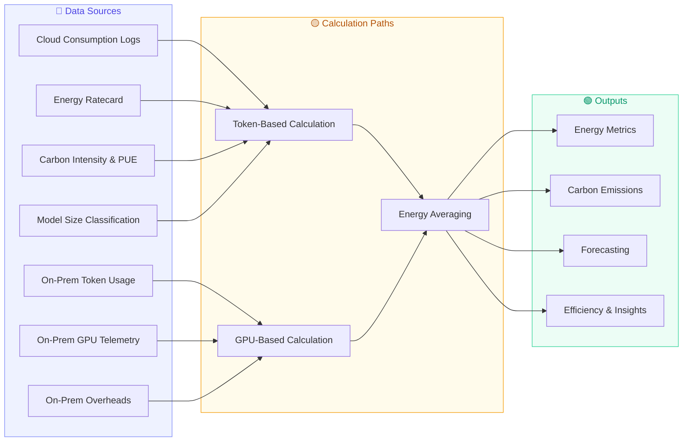
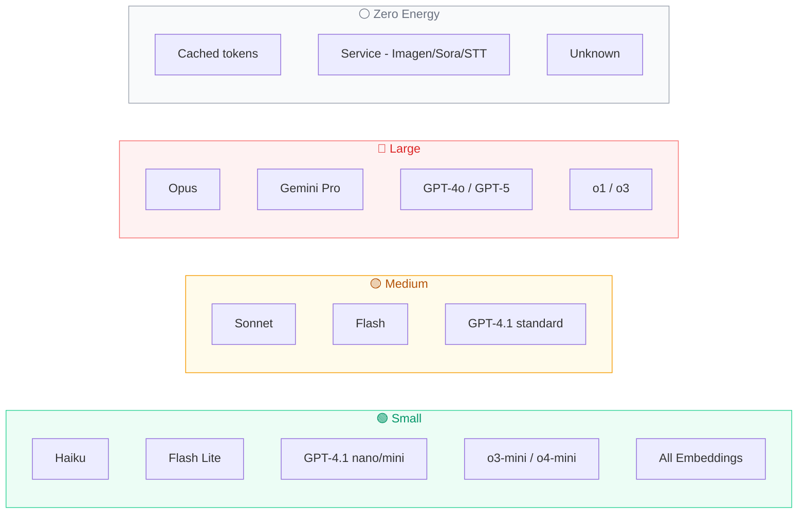
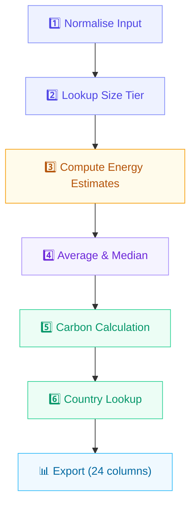

<div align="center">

# ⚡ AI Energy Usage Methodology

**Calculating energy consumption and carbon emissions from AI workloads**

[](#)
[](#)
[](#)

</div>

---

## 🔭 Overview

We quantify energy consumption and carbon emissions from AI workloads across GCP, Azure, Amazon Bedrock, and on-premise GPU infrastructure. Each cloud billing row produces eight independent energy estimates. Average those into a primary figure, then multiply by regional carbon intensity from the Green Software Foundation to get kgCO₂e.



---

## 📥 1. Source Data

### 1.1 Raw Cloud Consumption

> [!NOTE]
> Cloud billing exports one row per (date, workload, region, model, consumption type), refreshed monthly.

| Column | Description | Example |
|:---|:---|:---|
| `Invoice Date` | Billing month | `01/12/2025` |
| `Business Group` | Organisational unit | `Technology` |
| `Application ID` | Application identifier | `APP-001` |
| `Workload` | Workload or application name | `my-ai-workload` |
| `Vendor` | Cloud provider | `GCP` / `Azure` / `Amazon` |
| `Product Name` | Product (Amazon: contains model name) | `Claude Opus 4.5 (Amazon Bedrock Edition)` |
| `Region` | Cloud region | `europe-west2`, `eastus` |
| `Model` | Model billing descriptor | `Gemini 2.5 Flash GA Text Output` |
| `Consumption Type` | Token direction | `Input` / `Output` / `Embedding` |
| `Usage Quantity` | Token count | `15413` |

> [!IMPORTANT]
> **Vendor-specific handling:**
> - **Amazon:** The `Model` column contains billing metadata. The actual model name is in `Product Name`.
> - **Azure:** Azure bills regions as `Display Name::api_name` (e.g. `UK South::uksouth`). Extract the api_name for lookups.
> - **GCP:** Use `Model` and `Region` as-is.

---

## 📋 2. Reference Tables

### 2.1 Model Size Classification

Each unique billing model name maps to a size tier. The tier determines which energy rate the calculation uses.

| Column | Description |
|:---|:---|
| `Vendor` | `GCP` / `Azure` / `Amazon` |
| `Lookup_Key` | Model name (or Product Name for Amazon) |
| `Cache_In_Billing_Descriptor` | Yes/No — cached token entry (Amazon only) |
| `Model_Family` | Cleaned model family name |
| `Size_Tier` | `Small` / `Medium` / `Large` / `Cached` / `Service` / `Unknown` |



> [!TIP]
> Embedding models count as **Small** and use Small Input rates.

### 2.2 Token Energy Benchmark Rates

Each billing row carries a model name, token direction (Input / Output), and token count. You multiply those tokens by the published Wh/token rate for that model's size tier and direction to get an energy figure in MWh.

Three estimate types span from conservative to aggressive:

<table>
<tr>
<th>Estimate Type</th>
<th>Size Tier</th>
<th>Direction</th>
<th>Rate (Wh/token)</th>
</tr>
<tr><td rowspan="2"><b>🔻 Lower Bound</b></td><td>ALL</td><td>Input</td><td><em>TBC</em></td></tr>
<tr><td>ALL</td><td>Output</td><td><em>TBC</em></td></tr>
<tr><td rowspan="2"><b>🔺 Upper Bound</b></td><td>ALL</td><td>Input</td><td><em>TBC</em></td></tr>
<tr><td>ALL</td><td>Output</td><td><em>TBC</em></td></tr>
<tr><td rowspan="6"><b>🎯 Best Estimate</b></td><td>Small</td><td>Input</td><td><em>TBC</em></td></tr>
<tr><td>Small</td><td>Output</td><td><em>TBC</em></td></tr>
<tr><td>Medium</td><td>Input</td><td><em>TBC</em></td></tr>
<tr><td>Medium</td><td>Output</td><td><em>TBC</em></td></tr>
<tr><td>Large</td><td>Input</td><td><em>TBC</em></td></tr>
<tr><td>Large</td><td>Output</td><td><em>TBC</em></td></tr>
</table>

> [!NOTE]
> - **Lower / Upper bounds** use the same rate for all model families, spanning conservative to aggressive
> - **Best Estimate** uses separate rates per size tier (Small, Medium, Large) and per direction (Input, Output)
> - Output tokens cost more energy than input tokens: each output token requires a full forward pass through the model

### 2.3 GPU Fleet Assumptions

We derive Wh/token rates from measured on-premise GPU fleet data: peak power, idle power, and daily token throughput. Three utilisation levels model the realistic range of GPU load:

| Column | Description |
|:---|:---|
| `GPU Fleet Estimate (20% Util)` | Energy per token at low fleet utilisation |
| `GPU Fleet Estimate (40% Util)` | Energy per token at moderate fleet utilisation |
| `GPU Fleet Estimate (80% Util)` | Energy per token at high fleet utilisation |

> [!NOTE]
> All three scenarios enter the 8-estimate average and bracket plausible GPU load alongside the token energy benchmarks and empirical on-prem rates.

### 2.4 On-Prem Empirical Rates

We calculate these rates by dividing measured GPU power consumption by observed on-prem token throughput. We include two measurement sets, each with an all-token rate and a separate output-token rate:

| Column | Description |
|:---|:---|
| `Onprem Tokens Estimate (MWh)` | Empirical rate × all tokens (input + output) |
| `Onprem Output Tokens Estimate (MWh)` | Empirical rate × output tokens only |
| `New Token Energy (OnP)` | Updated empirical rate × all tokens |
| `New Output Token Energy (OnP)` | Updated empirical rate × output tokens only |

### 2.5 Region PUE & Carbon Intensity

> From the **Green Software Foundation (GSF)**. Per cloud region.

| Column | Description |
|:---|:---|
| `cloud-provider` | Amazon Web Services / Google Cloud / Microsoft Azure |
| `cloud-region` | Region API name (e.g. `europe-west2`, `eastus`) |
| `power-usage-effectiveness` | PUE value (where available) |
| `grid-carbon-intensity-average-consumption-annual` | gCO₂e/kWh |
| `country` | Country name |

> [!WARNING]
> Regions with no match or a zero intensity value default to **445 gCO₂e/kWh**.

---

## ⚙️ 3. Transformation Steps



### Step 1: Normalise Input

| Operation | Detail |
|:---|:---|
| Parse date | `DD/MM/YYYY` → `YYYY-MM-DD` |
| Resolve model name | Amazon: use `Product Name`. GCP/Azure: use `Model`. |
| Normalise region | Azure: extract api_name from `Display::api_name` format |
| Consumption type | Already present as `Input` / `Output` / `Embedding` |

### Step 2: Lookup Size Tier

Join raw billing data to the Model Size Classification table on `(Vendor, Model)`. For Amazon rows, also check whether the raw `Model` column contains "Cache". Amazon uses separate billing entries for cached tokens. Treat Embedding rows as Small for rate selection.

### Step 3: Compute Energy Estimates

> [!IMPORTANT]
> All energy columns follow the same core formula:
> ```
> Energy (MWh) = 1.2 × rate_wh_per_token × token_count / 1,000,000
> ```
> The **1.2 multiplier** adds 20% for non-GPU energy (networking, storage, CPU) and applies to all estimates.
>
> Rows with Size in (`Cached`, `Service`, `Unknown`, `No match`) get **zero** for all energy columns.

#### 3a. Token Energy Benchmark Estimates (3 columns)

| Column | Rate selection |
|:---|:---|
| `Token Energy - Lower Bound (MWh)` | Lower bound rate by Input/Output |
| `Token Energy - Upper Bound (MWh)` | Upper bound rate by Input/Output |
| `Token Energy - Best Estimate (MWh)` | Best estimate rate by Size Tier × Input/Output |

Embedding rows use Input rates and the Small tier for best estimate.

#### 3b. On-Prem Token Estimates (2 columns)

| Column | Condition |
|:---|:---|
| `Onprem Tokens Estimate (MWh)` | Size in (S, M, L) — all tokens |
| `Onprem Output Tokens Estimate (MWh)` | Size in (S, M, L) AND `Output` tokens only |

#### 3c. GPU Fleet Estimates (3 columns)

| Column | Description |
|:---|:---|
| `GPU Fleet Estimate (20% Util)` | Fleet energy rate at 20% GPU utilisation × token count |
| `GPU Fleet Estimate (40% Util)` | Fleet energy rate at 40% GPU utilisation × token count |
| `GPU Fleet Estimate (80% Util)` | Fleet energy rate at 80% GPU utilisation × token count |

#### 3d. New On-Prem Estimates (2 columns)

| Column | Condition |
|:---|:---|
| `New Token Energy (OnP)` | Size in (S, M, L) — all tokens |
| `New Output Token Energy (OnP)` | Size in (S, M, L) AND `Output` tokens only |

### Step 4: Averaging

The calculation produces three aggregate figures from the 8 estimates:

| Column | Definition |
|:---|:---|
| `Average (MWh)` | AVERAGE of all 8 energy columns |
| `Median (MWh)` | MEDIAN of all 8 energy columns |
| `Average Without Lower Bound (MWh)` | AVERAGE of 7 columns (excl. lower bound) |

> [!TIP]
> Use **Average Without Lower Bound** for carbon calculations. The lower bound pulls the mean down; it is a known conservative outlier.

### Step 5: Carbon Calculation

```
Region Carbon Intensity = LOOKUP(region → grid-carbon-intensity)
                          Default: 445 gCO₂e/kWh if missing or zero

Carbon Usage (kgCO₂e)  = (Carbon Intensity / 1000) × (Avg Without Lower Bound × 1000)
```

### Step 6: Country Lookup

```
Country = LOOKUP(region → country name from Region PUE table)
          Default: "N/A"
```

---

## 📊 4. Output Schema

The final export has **24 columns**:

<table>
<tr><th>#</th><th>Column</th><th>Type</th><th>Description</th></tr>
<tr><td>1</td><td><code>Invoice date</code></td><td>DATE</td><td>Billing month (YYYY-MM-DD)</td></tr>
<tr><td>2</td><td><code>Vendor</code></td><td>STRING</td><td>GCP / Azure / Amazon</td></tr>
<tr><td>3</td><td><code>Workload</code></td><td>STRING</td><td>Workload or application name</td></tr>
<tr><td>4</td><td><code>Region</code></td><td>STRING</td><td>Cloud region (api name)</td></tr>
<tr><td>5</td><td><code>Model</code></td><td>STRING</td><td>Model name</td></tr>
<tr><td>6</td><td><code>Consumption Type</code></td><td>STRING</td><td>Input / Output / Embedding</td></tr>
<tr><td>7</td><td><code>TokenCount</code></td><td>INT</td><td>Number of tokens</td></tr>
<tr><td>8</td><td><code>Size</code></td><td>STRING</td><td>Small / Medium / Large / Cached / Service</td></tr>
<tr><td colspan="4" style="background:#EEF2FF"><b>Token Energy Benchmark Estimates</b></td></tr>
<tr><td>9</td><td><code>Token Energy - Lower Bound (MWh)</code></td><td>FLOAT</td><td>Conservative energy estimate</td></tr>
<tr><td>10</td><td><code>Token Energy - Upper Bound (MWh)</code></td><td>FLOAT</td><td>Aggressive energy estimate</td></tr>
<tr><td>11</td><td><code>Token Energy - Best Estimate (MWh)</code></td><td>FLOAT</td><td>Size-tiered energy estimate</td></tr>
<tr><td colspan="4" style="background:#FFFBEB"><b>On-Prem Estimates</b></td></tr>
<tr><td>12</td><td><code>Onprem Tokens Estimate (MWh)</code></td><td>FLOAT</td><td>On-prem rate × all tokens</td></tr>
<tr><td>13</td><td><code>Onprem Output Tokens Estimate (MWh)</code></td><td>FLOAT</td><td>On-prem rate × output tokens</td></tr>
<tr><td colspan="4" style="background:#F0F9FF"><b>GPU Fleet Estimates</b></td></tr>
<tr><td>14</td><td><code>GPU Fleet Estimate (20% Util)</code></td><td>FLOAT</td><td>GPU fleet @ 20% utilisation</td></tr>
<tr><td>15</td><td><code>GPU Fleet Estimate (40% Util)</code></td><td>FLOAT</td><td>GPU fleet @ 40% utilisation</td></tr>
<tr><td>16</td><td><code>GPU Fleet Estimate (80% Util)</code></td><td>FLOAT</td><td>GPU fleet @ 80% utilisation</td></tr>
<tr><td colspan="4" style="background:#F5F3FF"><b>Empirical On-Prem Estimates</b></td></tr>
<tr><td>17</td><td><code>New Token Energy (OnP)</code></td><td>FLOAT</td><td>Measured rate × all tokens</td></tr>
<tr><td>18</td><td><code>New Output Token Energy (OnP)</code></td><td>FLOAT</td><td>Measured rate × output tokens</td></tr>
<tr><td colspan="4" style="background:#ECFDF5"><b>Blended & Carbon</b></td></tr>
<tr><td>19</td><td><code>Average (MWh)</code></td><td>FLOAT</td><td>Mean of 8 estimates</td></tr>
<tr><td>20</td><td><code>Median (MWh)</code></td><td>FLOAT</td><td>Median of 8 estimates</td></tr>
<tr><td>21</td><td><code>Average Without Lower Bound (MWh)</code></td><td>FLOAT</td><td>Mean of 7 estimates (excl. lower bound)</td></tr>
<tr><td>22</td><td><code>Region Carbon Intensity</code></td><td>FLOAT</td><td>gCO₂e/kWh from GSF</td></tr>
<tr><td>23</td><td><code>Carbon Usage (kgCo2e)</code></td><td>FLOAT</td><td>Energy × carbon intensity</td></tr>
<tr><td>24</td><td><code>Country</code></td><td>STRING</td><td>Country of cloud region</td></tr>
</table>

---

## 🏗️ 5. BigQuery Implementation

### 5.1 Table Setup

```sql
-- 📋 Reference: Token energy benchmark ratecard
CREATE TABLE ai_energy.token_energy_ratecard (
  estimate_type     STRING,     -- lower_bound / upper_bound / best_estimate
  size_tier         STRING,     -- ALL / Small / Medium / Large
  token_direction   STRING,     -- Input / Output
  rate_wh_per_token FLOAT64
);

-- ⚡ Reference: On-prem & GPU fleet ratecard
CREATE TABLE ai_energy.onprem_ratecard (
  rate_name         STRING,     -- onprem_token / onprem_output / gpu_20 / gpu_40 / gpu_80 / new_token / new_output
  rate_wh_per_token FLOAT64,
  applies_to        STRING      -- all / output_only
);

-- 🏷️ Reference: Model tier mapping
CREATE TABLE ai_energy.model_tier_mapping (
  Vendor            STRING,
  Lookup_Key        STRING,
  Cache_In_Billing_Descriptor STRING,
  Model_Family      STRING,
  Size_Tier         STRING,
  Notes             STRING
);

-- 🌍 Reference: Region PUE & carbon intensity
CREATE TABLE ai_energy.region_pue (
  cloud_provider        STRING,
  cloud_region          STRING,
  country               STRING,
  pue                   FLOAT64,
  grid_carbon_intensity FLOAT64
);

-- 📥 Raw data (refreshed monthly)
CREATE TABLE ai_energy.raw_cloud_consumption (
  Invoice_Date      STRING,
  Business_Group    STRING,
  Application_ID    STRING,
  Workload          STRING,
  Vendor            STRING,
  Product_Name      STRING,
  Region            STRING,
  Model             STRING,
  Consumption_Type  STRING,
  Usage_Quantity    FLOAT64
);
```

**On-prem ratecard rows** (one row per rate, values derived from fleet measurements):

| rate_name | applies_to | Description |
|:---|:---|:---|
| `onprem_token` | all | Empirical all-token rate from measured GPU power ÷ throughput |
| `onprem_output` | output_only | Empirical output-token rate |
| `gpu_20` | all | Fleet rate at 20% GPU utilisation |
| `gpu_40` | all | Fleet rate at 40% GPU utilisation |
| `gpu_80` | all | Fleet rate at 80% GPU utilisation |
| `new_token` | all | Updated empirical all-token rate |
| `new_output` | output_only | Updated empirical output-token rate |

### 5.2 Staging View

```sql
CREATE OR REPLACE VIEW ai_energy.stg_consumption AS
SELECT
  PARSE_DATE('%d/%m/%Y', Invoice_Date) AS invoice_date,
  Vendor,
  Workload          AS workload,
  CASE
    WHEN Vendor = 'Azure' AND CONTAINS_SUBSTR(Region, '::')
    THEN SPLIT(Region, '::')[OFFSET(1)]
    ELSE TRIM(Region)
  END AS region,
  CASE
    WHEN Vendor = 'Amazon' THEN TRIM(Product_Name)
    ELSE TRIM(Model)
  END AS model,
  TRIM(Consumption_Type) AS consumption_type,
  Usage_Quantity AS token_count,
  -- Amazon cache detection: raw Model column contains "Cache" for cached token billing entries
  CASE
    WHEN Vendor = 'Amazon' AND LOWER(Model) LIKE '%cache%' THEN 'Yes'
    ELSE 'No'
  END AS is_cached_token
FROM ai_energy.raw_cloud_consumption
```

### 5.3 Size Tier Join

```sql
CREATE OR REPLACE VIEW ai_energy.consumption_with_size AS
SELECT
  c.*,
  COALESCE(m.Size_Tier, 'No match') AS size_tier,
  CASE WHEN c.consumption_type = 'Embedding' THEN 'Input'
       ELSE c.consumption_type END AS effective_type,
  COALESCE(m.Size_Tier, 'No match') IN ('Small', 'Medium', 'Large') AS has_energy
FROM ai_energy.stg_consumption c
LEFT JOIN ai_energy.model_tier_mapping m
  ON c.model = m.Lookup_Key
  AND m.Vendor = c.Vendor
  AND (
    -- Amazon has separate cached/non-cached entries; match on the cache flag
    c.Vendor != 'Amazon'
    OR COALESCE(m.Cache_In_Billing_Descriptor, 'No') = c.is_cached_token
  )
```

### 5.4 Energy Calculation

```sql
CREATE OR REPLACE VIEW ai_energy.export AS
WITH rates AS (
  -- Pivot on-prem ratecard into columns for easy reference
  SELECT
    MAX(IF(rate_name = 'onprem_token', rate_wh_per_token, NULL)) AS onprem_token,
    MAX(IF(rate_name = 'onprem_output', rate_wh_per_token, NULL)) AS onprem_output,
    MAX(IF(rate_name = 'gpu_20', rate_wh_per_token, NULL)) AS gpu_20,
    MAX(IF(rate_name = 'gpu_40', rate_wh_per_token, NULL)) AS gpu_40,
    MAX(IF(rate_name = 'gpu_80', rate_wh_per_token, NULL)) AS gpu_80,
    MAX(IF(rate_name = 'new_token', rate_wh_per_token, NULL)) AS new_token,
    MAX(IF(rate_name = 'new_output', rate_wh_per_token, NULL)) AS new_output
  FROM ai_energy.onprem_ratecard
),

energy AS (
  SELECT
    c.*,

    -- Token Energy Lower Bound
    IF(c.has_energy,
      1.2 * tel.rate_wh_per_token * c.token_count / 1000000,
      0) AS te_lower,

    -- Token Energy Upper Bound
    IF(c.has_energy,
      1.2 * te_ub.rate_wh_per_token * c.token_count / 1000000,
      0) AS te_upper,

    -- Token Energy Best Estimate
    IF(c.has_energy,
      1.2 * COALESCE(teb.rate_wh_per_token, 0) * c.token_count / 1000000,
      0) AS te_best,

    -- Onprem Tokens Estimate
    IF(c.has_energy,
      1.2 * r.onprem_token * c.token_count / 1000000,
      0) AS onprem_tokens,

    -- Onprem Output Tokens Estimate
    IF(c.has_energy AND c.consumption_type = 'Output',
      1.2 * r.onprem_output * c.token_count / 1000000,
      0) AS onprem_output,

    -- GPU Fleet Estimates
    IF(c.has_energy, 1.2 * r.gpu_20 * c.token_count / 1000000, 0) AS gpu_20,
    IF(c.has_energy, 1.2 * r.gpu_40 * c.token_count / 1000000, 0) AS gpu_40,
    IF(c.has_energy, 1.2 * r.gpu_80 * c.token_count / 1000000, 0) AS gpu_80,

    -- New On-Prem Estimates
    IF(c.has_energy, 1.2 * r.new_token * c.token_count / 1000000, 0) AS new_token,
    IF(c.has_energy AND c.consumption_type = 'Output',
      1.2 * r.new_output * c.token_count / 1000000,
      0) AS new_output

  FROM ai_energy.consumption_with_size c
  CROSS JOIN rates r
  LEFT JOIN ai_energy.token_energy_ratecard tel
    ON tel.estimate_type = 'lower_bound'
    AND tel.token_direction = c.effective_type
  LEFT JOIN ai_energy.token_energy_ratecard te_ub
    ON te_ub.estimate_type = 'upper_bound'
    AND te_ub.token_direction = c.effective_type
  LEFT JOIN ai_energy.token_energy_ratecard teb
    ON teb.estimate_type = 'best_estimate'
    AND teb.size_tier = c.size_tier
    AND teb.token_direction = c.effective_type
),

averaged AS (
  SELECT
    e.*,

    -- Mean of all 8 estimates
    (e.te_lower + e.te_upper + e.te_best + e.gpu_20 + e.gpu_40
      + e.gpu_80 + e.new_token + e.new_output) / 8 AS avg_mwh,

    -- Median of 8 estimates (average of 4th and 5th sorted values)
    (SELECT (arr[OFFSET(3)] + arr[OFFSET(4)]) / 2
     FROM (SELECT ARRAY_AGG(v ORDER BY v) AS arr
           FROM UNNEST([e.te_lower, e.te_upper, e.te_best, e.gpu_20,
                        e.gpu_40, e.gpu_80, e.new_token, e.new_output]) v)
    ) AS median_mwh,

    -- Mean excluding lower bound (7 estimates)
    (e.te_upper + e.te_best + e.gpu_20 + e.gpu_40 + e.gpu_80
      + e.new_token + e.new_output) / 7 AS avg_no_lower

  FROM energy e
)

SELECT
  a.invoice_date,
  a.Vendor,
  a.workload,
  a.region,
  a.model,
  a.consumption_type,
  CAST(a.token_count AS INT64)  AS token_count,
  a.size_tier,
  a.te_lower                   AS `Token Energy - Lower Bound (MWh)`,
  a.te_upper                   AS `Token Energy - Upper Bound (MWh)`,
  a.te_best                    AS `Token Energy - Best Estimate (MWh)`,
  a.onprem_tokens               AS `Onprem Tokens Estimate (MWh)`,
  a.onprem_output               AS `Onprem Output Tokens Estimate (MWh)`,
  a.gpu_20                      AS `GPU Fleet Estimate (20% Util)`,
  a.gpu_40                      AS `GPU Fleet Estimate (40% Util)`,
  a.gpu_80                      AS `GPU Fleet Estimate (80% Util)`,
  a.new_token                   AS `New Token Energy (OnP)`,
  a.new_output                  AS `New Output Token Energy (OnP)`,
  a.avg_mwh                     AS `Average (MWh)`,
  a.median_mwh                  AS `Median (MWh)`,
  a.avg_no_lower                AS `Average Without Lower Bound (MWh)`,
  COALESCE(IF(rgn.grid_carbon_intensity = 0, 445, rgn.grid_carbon_intensity), 445)
                                AS `Region Carbon Intensity (gCo2e/kWh)`,
  (COALESCE(IF(rgn.grid_carbon_intensity = 0, 445, rgn.grid_carbon_intensity), 445) / 1000)
    * (a.avg_no_lower * 1000)
                                AS `Carbon Usage (kgCo2e)`,
  COALESCE(rgn.country, 'N/A') AS Country
FROM averaged a
LEFT JOIN ai_energy.region_pue rgn
  ON LOWER(a.region) = LOWER(rgn.cloud_region)
```

### 5.5 Scheduling

| Component | Tool | Frequency |
|:---|:---|:---|
| Raw CSV ingestion | Cloud Storage → BigQuery transfer | Monthly |
| Model tier mapping | Manual upload or CI/CD | As needed (new models) |
| Token energy ratecard | Manual upload | When benchmark rates updated |
| Region PUE | Manual upload | Annually (GSF release) |
| Export view | Materialised view or dbt | Auto-refreshes on query |

---

## 🔑 6. Key Assumptions

> [!CAUTION]
> Changing any of these assumptions changes every energy and carbon figure in the output.

| Assumption | Detail |
|:---|:---|
| **20% non-GPU uplift** | A fixed 1.2× multiplier on every estimate. Covers networking, storage, and CPU overhead not captured in GPU power alone. |
| **Model → tier mapping** | We classify each model by family name. Embedding models count as Small. |
| **Token energy benchmark rates** | Published Wh/token figures covering GPU energy only, split by model size and token direction. We add the non-GPU uplift on top. |
| **Carbon intensity** | We use the GSF annual average per region. Unknown or zero-intensity regions fall back to 445 gCO₂e/kWh. |
| **Cached tokens** | Cached entries get zero energy. The model serves cached tokens from memory without running inference. |
| **On-prem rates on cloud** | We include on-prem rates as cross-estimates to widen the average, not to measure actual on-prem consumption. |

---

## ⚠️ 7. Limitations

| Limitation | Impact |
|:---|:---|
| **Monthly granularity** | No intra-month or per-request precision |
| **No cloud GPU telemetry** | Cloud energy is estimated from tokens, not measured |
| **Size-tier approximation** | All models in a tier share the same rate |
| **Annual carbon intensity** | Does not capture hourly or seasonal grid variation |
| **On-prem rates as constants** | Derived from a specific fleet and time period |
| **Idle power** | Not yet apportioned between workloads for on-prem |
